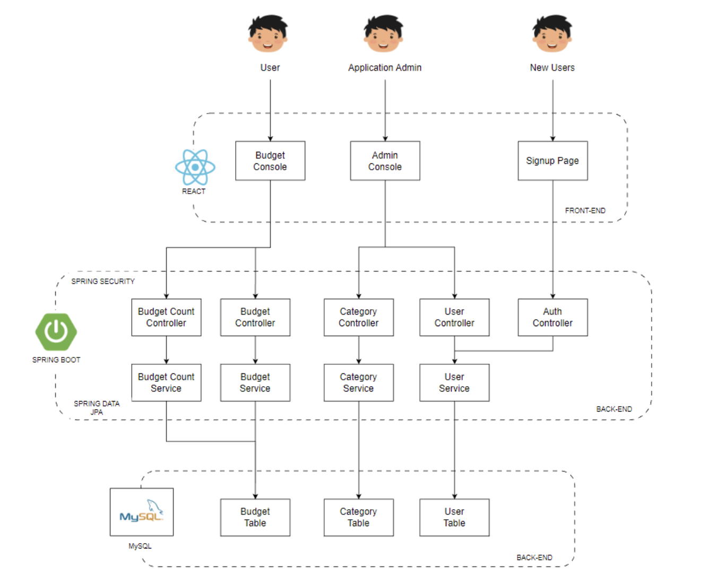

# **IN6225 - Assignment**

## **Topic: Budget App**
This assignment involves creating a Budget App using Spring Boot, MySQL and React. 

---
## **1. Functional Requirements**

This application consists of 2 different types of users: 
1. Application Administrator
2. User


### **Authentication and Authorization**
- The Application Administrator & user must be able to login to the application
- The user must be able to register a new account in the application, by supplying the following inputs:
  1. Username
  2. Password
  3. First Name
  4. Last Name
  5. Email Address
- The Application Administrator must be able to access the admin console in the application
- The user must be able to access the budgets console in the application
- The user must not be able to see the admin console in the application
- The Application Administrator must not be able to see the budgets console in the application
- The Application Administrator & user must be able to logout from the application

### **Users Management**
- The Application Administrator must be able to see the total number of users in the application
- The Application Administrator must be able to update the users’ details on the application
- The Application Administrator must be able to delete the users’ details from the application

### **Categories Management**
- The Application Administrator must be able to see the total number of categories in the application
- The Application Administrator must be able to add a new category in the application
- The Application Administrator must be able to update a category in the application
- The Application Administrator must be able to delete a category in the application

### **Budgets Management**
- The user must be able to see their submitted budget entries in the application
- The user must not be able to see budget entries submitted by other users
- The user must be able to see their submitted budget entries based on a desired category in the application
- The user must be able to add a new budget entry into the application, with the following inputs:
  1. Amount (SGD)
  2. Category Name
  3. Description
- The user must be able to update a budget entry in the application
- The user must be able to delete a budget entry in the application
- The user must be able to see their total income in the application
- The user must be able to see their total expenditure in the application
- The user must be able to see their total savings (income – expenditure) in the application


## **2. Entity-Relationship Diagram**
---


## **3. Architecture Diagram**
---


## **4. Tech Stack**
---

### **Frontend**
- React

### **Backend**
- Spring Boot 
  - Spring Security
  - Spring MVC
  - Spring Data JPA
- MySql 

## **5. Components**

### **Budgetapp-UI (Frontend Component)**
The frontend application was developed using React. It is an open-source, component based front-end Javascript library that is responsible for building the view layer of the application. React allows the use of components, which are reusable chunks of code that can be utilised across the frontend component. 

In the context of the Budget Application, the frontend is split into 2 different components: 
- Admin page
- User page 
  
The frontend communicates to the backend through Axios, which is a promise-based HTTP client for node.js and the browser.  To enable role-based access control (RBAC) on the application, the frontend queries for the user details and checks for the user’s role. If the user role is ADMIN, he/she will only be able to see the admin page. Otherwise he will see the user page. 

### **Budgetapp-Server (Backend Component)**
The backend application was developed using Spring Boot, which is an open-source Java-based framework that is mainly used to create microservices. It significantly decreases the amount of time required for developers to create web applications, as Spring Boot provides a huge degree of auto-configuration and eases the dependency management required by developers. 

The following dependencies are declared in this Spring Boot application: 
- Spring-boot-starter-data-jpa
- Spring-boot-starter-web
- Mysql-connector-j
- Hibernate-core
- Spring-boot-starter-test
- Spring-boot-starter-security 
  
Spring MVC Controllers are used to handle HTTP requests received by the application, and route the requests to the respective service classes. The following controllers are created for this application: 
- AuthController
- BudgetController
- BudgetCountController
- CategoryController
- UserController

Spring Data JPA is used to simplify how the web application interfaces with databases. By creating entities in our web application, data can be represented as Plain Old Java Objects (POJOs) that can be persisted to the MySQL database. It abstracts the need for developers to write database queries to insert application data into the database. The following entities are created for this application: 
- Category
- Budget
- User
  
Spring Security is used to enable authentication and authorization for our web application. All incoming HTTP Servlet requests go through the Spring Security filter chain before reaching the Spring MVC controller. In this application, the security filter chain matches for specific HTTP requests and checks if the currently logged in user has the relevant authority (ADMIN/USER), which was previously queried from the MySQL database. If the user does not have the correct authority, Spring Security will throw an unauthorised error. 

On application startup, a database initializer object will be instantiated to perform 2 functions: 
- If the User table is empty, insert 2 users (admin/testuser) to the User table
- If the Category table is empty, insert a set of predefined categories into the Category Table

## **6. Quickstart**

### **1. Budgetapp-Server**
```
cd budgetapp/budgetapp-server 

./mvnw clean spring-boot:run
```

### **2. Budgetapp-UI**
```
cd budgetapp/budgetapp-ui 

npm install 

npm start
```

You can access the budget app via http://localhost:3000. 

## **References**
---
- https://www.baeldung.com/spring-rest-openapi-documentation
- https://www.baeldung.com/spring-boot-react-crud
- https://www.bezkoder.com/react-spring-boot-crud/
- https://www.baeldung.com/spring-security-jdbc-authentication


